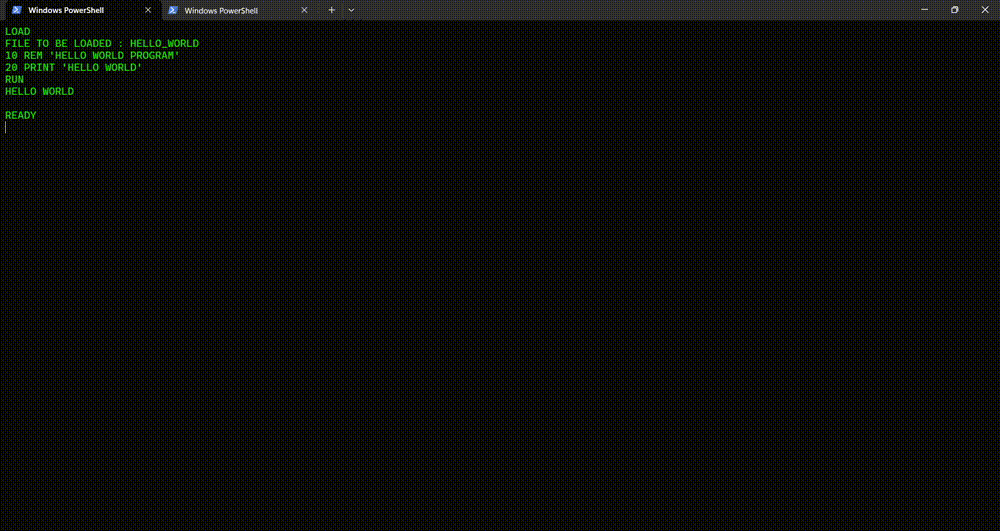

# Basic Interpreter
This is a personal project in which an interpreter for the computer language BASIC was implemented in python with custom lexer, parser and etc. The implementation was done completely from scratch.

## Demo of the Project

